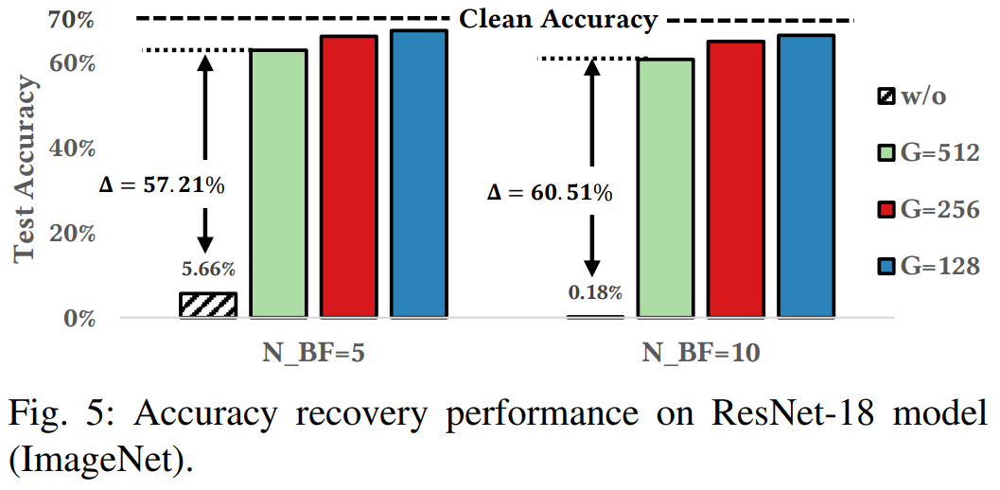

  
  
  
# RADAR: run-time check for BFA
  
  
This repository contains a Pytorch implementation of the paper "[RADAR: Run-time Adversarial Weight Attack Detection and Accuracy Recovery](https://arxiv.org/abs/2101.08254 )".
  
If you find this project useful to you, please cite [our work](https://arxiv.org/abs/2101.08254 ):
  
  
```
@article{li2021radar,
  title={RADAR: Run-time Adversarial Weight Attack Detection and Accuracy Recovery},
  author={Li, Jingtao and Rakin, Adnan Siraj and He, Zhezhi and Fan, Deliang and Chakrabarti, Chaitali},
  journal={arXiv preprint arXiv:2101.08254},
  year={2021}
}
```
  
## Table of Contents
  
- [Dependencies](#Dependencies )
- [Usage](#Usage )
- [Results](#Results )
  - ResNet-20 on CIFAR-10
  - ResNet-18 on ImageNet
- [Methods](#Methods )
  
  
## Dependencies:
  
  
* python=3.6 (Anaconda)
* pytorch=1.1.0
* torchvision=0.3.0
* config (pip install config)
  
## Usage
Download pretrained quantized CIFAR-10 ResNet-20 model and ImageNet ResNet-18 model from:
* [Google Drive](https://drive.google.com/drive/folders/15r5d8B9HPM0dGZQrSg6j2UT5fRy25DSM?usp=sharing ) (email me directly if link is not available)

To perform run-time checking using the pretrained model, please use the following command in terminal. For Imagenet, remember to revise the bash code with correct dataset path.
  
Perform RADAR checking on CIFAR-10 ResNet-20 moel:
```bash
bash check_CIFAR10.sh
```
  
Perform RADAR checking on ImageNet ResNet-18 moel:
```bash
bash check_ImageNet.sh
```

In order to get the bash code run correctly, inside the scripts, please modify the `PYTHON` environment, `imagenet_path` imagenent dataset path, and `resume_path` trained model path.

Set different number of bit-flips:
```bash
n_iter=2
```

Set different rounds of performing BFA:
```bash
massive=10
```

Set different group size of RADAR:
```bash
check_gsize=8
```

Turn on/off the **quick recovery** (locate ./models/quan_resnet_cifar_check.py line 35):

```python
rescue = True
```
## Results
  
### ResNet-20 on CIFAR-10:
  
The entire network is quantized to 8-bit for ResNet-20 on CIFAR-10.
  
The Accuracy results by sweeping different grain size will be similar to what we presented in **Table III** of the paper.


### ResNet-18 on ImageNet:

The entire network is quantized to 8-bit for ResNet-18 on ImageNet.
  
The Accuracy results by sweeping different grain size will be similar to what we presented in **Figure 5** of the paper.


